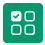
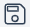
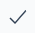

# Getting started

DoTenX helps you automate workflows with no-code. You can also use DoTenX to create SaaS, web or mobile applications.

Nothing is like learning by doing, so let's do the same here to learn DoTenX.

# Pill reminder

In this example, we create an automation that reminds us to take a pill every 8 hours. To be more clear, we want to receive 
a message on Slack and an email every 8 hours, reminding us to take a pill.

After logging in, click on My DoTenX to open the Automation Studio.

Use Automation Studio to automate any workflows <a class="button button--secondary button--lg" href="https://app.dotenx.com" target="blank">Open Automation Studio</a>

In the Automation Studio, click on <b>+ New Automation</b> to start creating an automation.

Now we can add Tasks and Triggers by simply dragging and dropping them from the menu on the right side.

Let's start by adding a Trigger that starts the automation every 8 hours by following these steps:

- Add a Trigger
- Click on the Cog to open the menu
- Choose the **dotenx** > **Schedule** as the Type
- Set the frequency to `28800` ( = 8 hours)
- Set the name to `Every 8 hours`

Now, we can add the Tasks to inform us about the pills on Slack and email.
In order to add the Task to send messages on Slack, follow these steps:

- Add a Task
- Click on the Cog to open the menu
- Choose the **Slack** > **Send slack message** as the Type
- Add an integration:
  - Click on the **New** button, next to the Integration dropdown
  - Click **Connect** on the integration menu or switch to advanced mode and provide the details
- Set the *ID* of the Slack channel you want to receive messages as **target id**
- Set the **text** to `It's time to take your pill`
- Set the name of the Task to `Slack message reminder`

We Finally add the Tasks to send an email whenever it's time to take the next pill by following these steps:

- Add a Task
- Click on the Cog to open the menu
- Choose the **Google** > **Google send email** as the Type
- Add an integration:
  - Click on the **New** button, next to the Integration dropdown
  - Click **Connect** on the integration menu or switch to advanced mode and provide the details
- Set the field **from** to `automated@dotenx.com`
- Set the field **to** to your email
- Set the **subject** to `Pill reminder`
- Set the **text** to `It's time to take your pill`
- Set the name of the Task to `Email reminder`

Now we have to save the Automation  and activate it 

Congratulations! You just created your first Automation with DoTenX.

